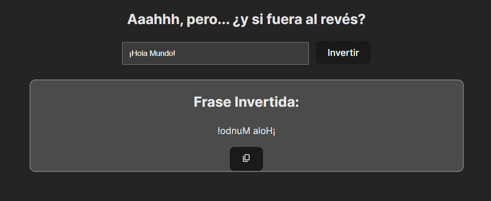

# 🌀 React Reverse Phrase App

¡Bienvenido a la **Reverse Phrase App**! Esta aplicación permite a los usuarios ingresar una frase y obtenerla al revés. También proporciona la opción de copiar el resultado invertido al portapapeles.

## 🌟 Características

- Inversión de frases al instante.
- Copia al portapapeles con un solo clic.
- Diseño limpio y responsivo.

🛠️ Construido con

<li> React - Biblioteca de JavaScript para construir interfaces de usuario.
 
 
 

🖥️ Captura de Pantalla

